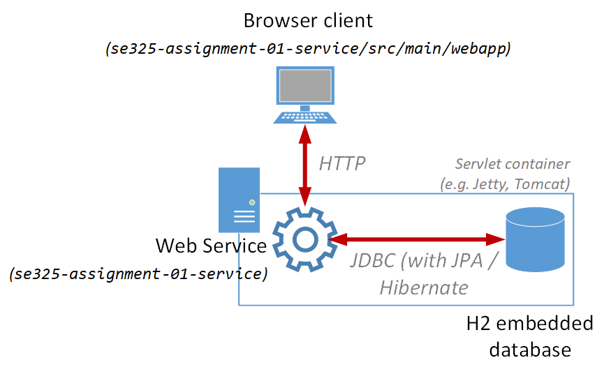
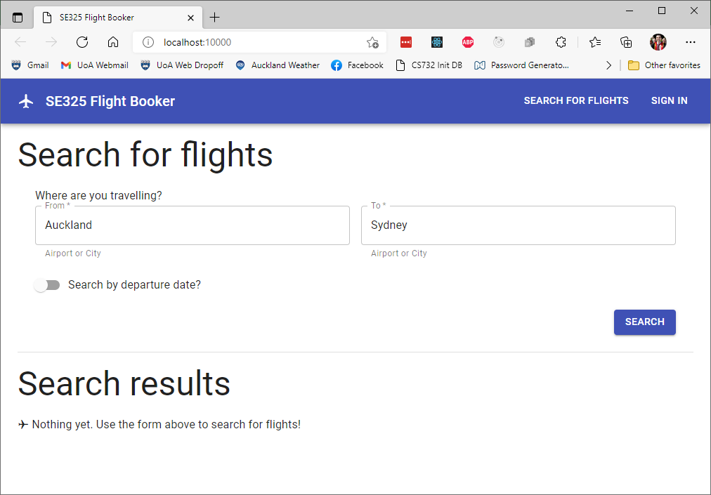
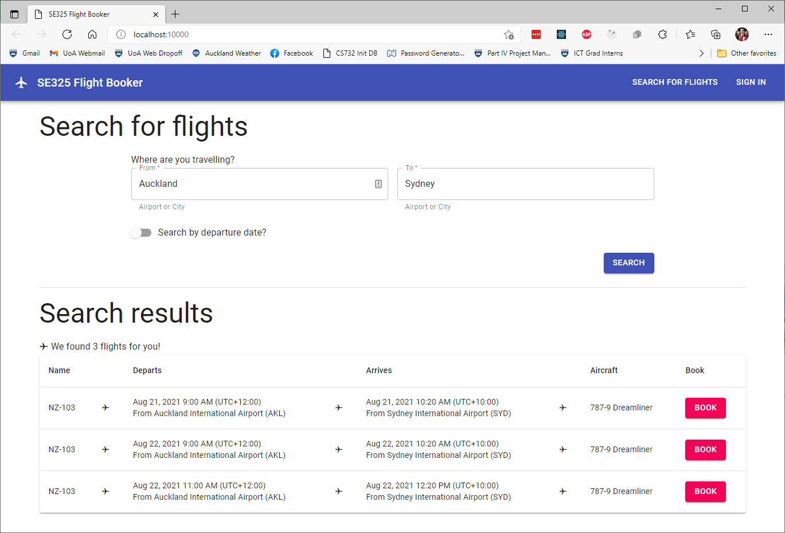
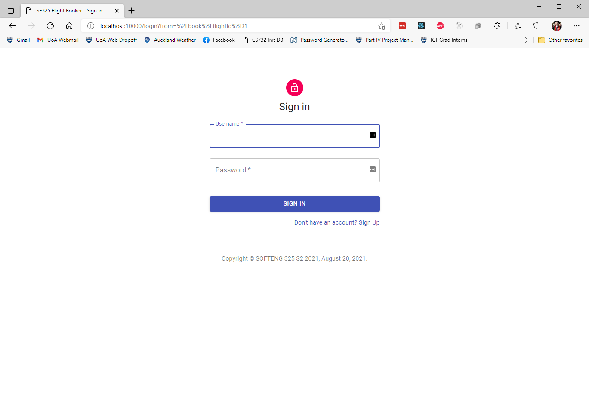
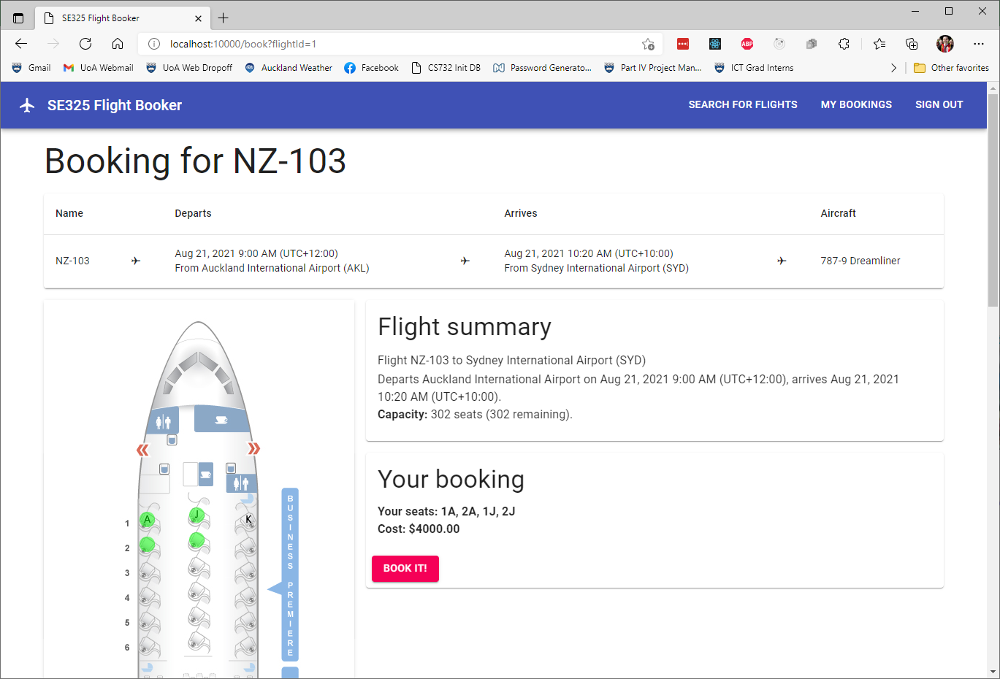
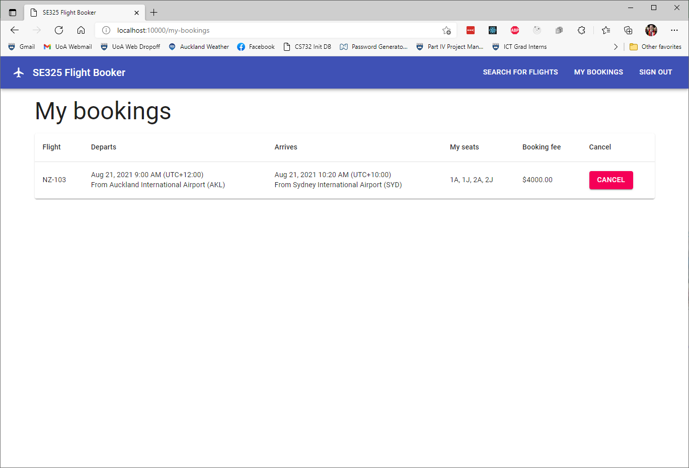
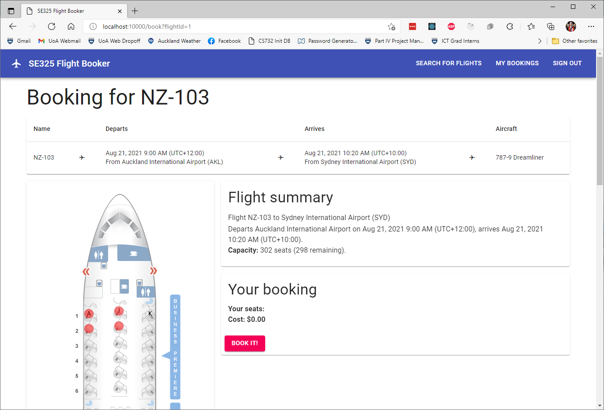

# SOFTENG 325 Assignment One - A Flight Booking Service
The aim of this assignment is to build a RESTful web service for querying and booking flights, using JAX-RS, JPA / Hibernate, and related technologies you've learned in this course.


## IMPORTANT Note!
**This assignment is copyright © Andrew Meads, 2021. You may not publish _any_ of the provided files to venues including, but not limited to, online forums and public GitHub repositories. If we spot copies of this assignment - _even your solutions_ - online (even after this course is finished), we will seek to have them taken down.** We really wish we didn't have to put this notice in, but we want to reuse this assignment in future iterations of the course, and do not want to have easily-searchable solutions to it online!


## System description
A booking service is required for a website which aggregates flights from several airlines, and airports, on several different kinds of aircraft. Anyone must be able to search for flights from / to particular origins / destinations, and optionally, by departure date.

Users must be able to create accounts with (unique) usernames and passwords. Once created, users should be allowed to log in and log out. While logged in, users must be able to book their desired seats on their chosen flights (assuming those seats aren't already taken). Seats on flights have a particular cabin class (e.g. Economy, Business, determined by the aircraft) and price (determined by the cabin class and the specific flight). Each seat on a flight must only be able to be booked once - i.e. double-bookings should be actively prevented. When requesting a booking, partial bookings can't be made - either *all* of a user's requested seats will be booked, or *none* of them will be. Authenticated users should also be able to query and cancel their own bookings.

In addition, authenticated users should be able to subscribe to information regarding flights. Specifically, they should be able to subscribe to be notified if and when a flight has a certain number of seats available, optionally of a given cabin class. This may happen, for example, if another user cancels their booking on the same flight.

A formalized definition of the REST interface that should be provided to clients is given below.

### REST interface
Base URL (to be prepended to all of the below): `/services`.

#### Users
- `POST /users`: Creates a new user account.
  - **Request payload**: `UserDTO` instance (containing username and password)
  - **Response codes**":
    - `201 Created` if success
    - `409 Conflict` if an account with the provided username already exists
  - **Response header**: A `Location` URI pointing to the newly created account.

- `POST /users/login`: Logs an existing user into the system.
  - **Request payload**: `UserDTO` instance (containing username and password)
  - **Response codes**:
    - `204 No Content` if success
    - `401 Unauthorized` if a matching account doesn't exist.
  - **Response header**: Authentication cookie to uniquely identify this user (if authentication successful).

- `GET /users/logout`: Logs out a user.
  - **Response codes**:
    - `204 No Content`
  - **Response header**: Authentication cookie with `maxAge` set to 0 (will cause the client to delete the cookie).

#### Flights
- `GET /flights`: Retrieves a list of flights matching provided search parameters.
  - **Request query params**:
    - `origin` and `destination` (compulsory): To be used in a string search on origin and destination airports' names (e.g. Auckland International Airport) and codes (e.g. AKL). The search will perform wildcard string matching and will match origins and destinations whose names or codes contain the given query params (case-insensitive).
    - `departureDate` (optional): A string in ISO Date format (YYYY-MM-DD, e.g. 2021-08-19). If supplied, the search will only match flights departing on the given date, *in the origin airport's timezone*.
  - **Response codes**:
    - `400 Bad Request` if `origin` or `destination` are not supplied, or if `departureDate` *is* supplied but is an invalid date
    - `200 OK` otherwise
  - **Response payload**: A list of `FlightDTO` instances, if the search was successful (even if 0 results are found).

- `GET /flights/{id}/booking-info`: Retrieves information about seat pricing and seats which have already been booked for a particular flight.
  - **Request path param**:
    - `id`: The id of the flight to check
  - **Response codes**:
    - `404 Not Found` if a flight with the given id doesn't exist
    - `200 OK` otherwise
  - **Response payload**: A single `BookingInfoDTO` instance corresponding to the requested flight.

#### Bookings
- `POST /bookings`: Allows authenticated users to make bookings on flights.
  - **Request header**: Authentication cookie for the user
  - **Request payload**: A `BookingRequestDTO` instance containing the id of the flight to book, as well as a list of seat codes to book on that flight
  - **Response codes**:
    - `401 Unauthorized` if not authenticated
    - `404 Not Found` if the requested flight doesn't exist
    - Either `404 Not Found` or `409 Conflict` (either is fine) if any of the requested seat codes are invalid or already booked
    - `201 Created` if the booking is successful
  - **Response header**: A `Location` URI pointing to the newly created booking.

- `GET /bookings`: Allows authenticated users to retrieve all of their own bookings.
  - **Request header**: Authentication cookie for the user
  - **Response codes**:
    - `401 Unauthorized` if not authenticated
    - `200 OK` otherwise
  - **Response payload**: A list of `FlightBookingDTO` instances corresponding to the authenticated user's bookings (even if that list is empty). The list should be sorted by departure date, in ascending order.

- `GET /bookings/{id}`: Allows authenticated users to retrieve one of their own bookings.
  - **Request header**: Authentication cookie for the user
  - **Request path param**:
    - `id`: The id of the booking to retrieve
  - **Response codes**:
    - `401 Unauthorized` if not authenticated
    - `404 Not Found` if the requested booking does not exist or does not belong to the authenticated user
    - `200 OK` otherwise
  - **Response payload**: A single `FlightBookingDTO` instance corresponding to the requested booking (if successful).

- `DELETE /bookings/{id}`: Allows authenticated users to cancel their bookings.
  - **Request header**: Authentication cookie for the user
  - **Request path param**:
    - `id`: The id of the booking to cancel
  - **Response codes**:
    - `401 Unauthorized` if not authenticated
    - `404 Not Found` if the requested booking does not exist or does not belong to the authenticated user
    - `204 No Content` otherwise.

#### Asynchronous web services
In addition to the above, there is a single *asynchronous* web service method which should be developed:

- `POST /flights/subscribe`: Allows authenticated users to subscribe to be notified when a certain number of seats for a particular flight (optionally of a given cabin class) open up.
  - **Request header**: Authentication cookie for the user
  - **Request payload**: An `AvailableSeatsSubscriptionDTO` instance, containing the flight id, the requested number of seats, and (optionally) the cabin class
  - **Response codes**:
    - `401 Unauthorized` if the user is not authenticated
    - `404 Not Found` if the flight with the given id doesn't exist
    - `204 No Content` once the requested number of seats of (optionally) the correct cabin class are available on the requested flight. This may take some time, so this should be handled asynchronously.


## System architecture and project structure
The system as a whole is a *tiered* architecture, in which a browser application, driven by a *web app*, communicates via HTTP with the *web service* you will create for this assignment. A high-level overview can be seen in the below diagram:



The project is given as a multi-module Maven project, which comprises two modules:

- `se325-assignment-01-common`: Contains the Data Transfer Object (DTO) classes, and other resources that are shared between the service layer and potential Java-based clients.

- `se325-assignment-01-service`: Contains the JPA / Hibernate domain classes, JAX-RS resource classes, and other utility classes which comprise the RESTful service. In addition to these, the service project also contains the unit and integration tests (see [**automated tests**](#automated-tests) below).

  - `se325-assignment-01-service/src/main/webapp`: When deployed to a servlet container, files in this directory can be navigated directly by clients (e.g. web browsers). The files given here contain the build output of a [React web application](https://reactjs.org/) (based on [create-react-app](https://github.com/facebook/create-react-app) and [Material-UI](https://material-ui.com/)), which has been included as an example of how your RESTful service can be consumed by "real" applications as opposed to just integration tests. See [**Appendix: The web client**](#appendix-the-web-client) below for more information on how to run and use this client.

### DTO classes
In the `se325-assignment-01-common` project, there are several DTO classes in the `se325.flights.dto` package. These classes, which have been fully configured with all necessary Jackson annotations, represent the information to be sent as JSON in the request / response bodies. For more information, see the classes themselves, along with the REST interface specification given above to see how they should be used.

### Domain classes
In the `se325-assignment-01-service` project, there are several domain classes in the `se325.flights.domain` package. These classes are *incomplete*, particularly in regard to the necessary JPA annotations. You'll be completing them as part of this assignment (see [**Tasks**](#tasks) below).

A description of the classes is given here:

- `User`: Represents a user account in the database. Stores the user's username, and a *SHA3-256 Hash* of their password. Incoming passwords can be hashed using the provided `se325.util.SecurityUtils` class.
- `Airport`: Represents an airport, which can be the origin or destination of a `Flight`. Airports have a name, code, location, and *time zone*. Timezones are entries in the [TZ Database](https://www.iana.org/time-zones) (e.g. "Pacific/Auckland" for Auckland's timezone). A full list o the timezeones can be found here: <https://en.wikipedia.org/wiki/List_of_tz_database_time_zones>.
- `AircraftType`: Represents a type of aircraft on which a `Flight` can be taken. Aircraft have a name, and any number of *seating zones* where passengers can sit.
  - `SeatingZone`: Contains information about one particular seating zone on an aircraft. This includes the cabin class of those seats (e.g. Economy, Business), the starting row number, the number of rows, and the valid seat letters for seats in that zone. If, for example, a seating zone has two rows, starting at row 10, and the valid letter codes are "AJK", then the seats in that seating zone would be 10A, 10J, 10K, 11A, 11J, and 11K. An aircraft's seating zones together collectively describe all the available seats on that aircraft.
- `Flight`: Represents a flight which can be taken by users. Flights have a name, an origin and destination `Airport`, a departure and arrival time (each [`ZonedDateTime`](https://docs.oracle.com/javase/8/docs/api/java/time/ZonedDateTime.html) rather than `LocalDateTime` instances, to take different timezones into account), an `AircraftType` describing the aircraft used for the flight, a list of `SeatPricing`s detailing the cost of tickets for particular cabin classes on that flight, and a list of `FlightBookings` describing the bookings which have been made for that flight.
  - `SeatPricing`: Contains information about the cost of tickets for a particular cabin class on a particular flight.
- `FlightBooking`: Represents a booking which has been made by a particular `User` for a particular `Flight`. Includes references to the user and flight, in addition to a list of `Seat`s which have been booked.
  - `Seat`: Contains information about a particular seat which has been booked on a flight. Contains the row number and letter code of the seat, as well as the price which was paid for that seat.

### Resource classes
In the `se325-assignment-01-service` project, there are several JAX-RS resource classes in the `se325.flights.service` package. These are almost entirely incomplete - implementing these will be the major implementation component of this assignment.

- `UserResource`: Intended to contain endpoints for the `/users` paths in the REST service interface (see [**REST interface**](#rest-interface) above).
- `FlightsResource`: Intended to contain endpoints for the `/flights` paths in the REST service interface (see [**REST interface**](#rest-interface) above).
- `BookingsResource`: Intended to contain endpoints for the `/bookings` paths in the REST service interface (see [**REST interface**](#rest-interface) above).

In addition, an extra resource class - `TestResource` - is provided, whose single web method will reset the database. This is used within the integration tests to ensure a clean slate at the beginning of each test. You do not need to modify this class.

### Other useful classes and files
There are a few other classes and files within the project. The most notable of these (all in the `se325-assignment-01-service` project) are:

- `se325.flights.domain.mappers`: Contains classes which map between DTO and domain classes. You shouldn't need to modify these classes - but will likely need to use them in your resource implementations.
- `se325.flights.util.SecurityUtils`: Contains methods which will help with authentication and user account creation. You do not need to modify this class, but may use it as you wish in your implementation.
- `se325.flights.service.SubscriptionManager`: Much of the logic involving asynchronous web services (see [**REST interface**](#rest-interface) above) should be placed here. The `processSubscriptions()` method is complete, and should be called at one or more appropriate locations within your code. The `processSingleSubscription()` method is incomplete, and should be implemented as part of this assignment.
- `src/main/resources/META-INF/persistence.xml`: Contains JPA / Hibernate configuration information. You do not need to edit this file.
- `src/main/resources/db-init.sql`: A database init script to add some dummy data to the database, which is run every time the JPA / Hibernate persistence context is created or reset. Investigating this class may prove useful when determining the required JPA annotations for your domain classes. In addition, slight modification of this file may be required depending on your strategy  for handling double-bookings.

### Automated tests
The service project (`se325-assignment-01-service/src/test/java`) Contains both *unit tests* for the domain classes, and *integration tests* for the web service as a whole.

- `se325.flights.domain.test` contains unit tests for the domain model classes. `TestDomainModel` can be run directly from IntelliJ by right-clicking and selecting "Run 'TestDomainModel'", or by running Maven's `test` goal (or above). Running the `test` goal will *not* cause the integration tests (below) to run, nor will it start a Jetty server on which to run those integration tests. Therefore, if you just want to test the domain model classes by themselves, this is the approach to take.

- `se325.flights.service.test` contains integration tests for the web service as a whole. These can be run by executing Maven's `verify` goal on the project root.


## Tasks
For this assignment, there are several tasks you must complete: Broadly, these are: *i)* completing the domain model, *ii)* implementing the web service methods, and *iii)* writing a short reflective report.

### Task One: Complete the domain model
To begin, complete the domain classes in the `se325.flights.domain` package. A description of these classes is given in the **Domain classes** section above, along with more information in the classes themselves.

The fields, methods and constructors of these classes are almost complete - the one exception to this is `Flight`'s `makeBooking()` method, which you must implement. In addition to implementing this method, you need to appropriately configure all the domain classes with the necessary JPA annotations to ensure correct functionality.

To test your domain model, just run the `TestDomainModel` unit tests. You don't need to fully run all the integration tests. You may run just `TestDomainModel`, either by runnung it directly from IntelliJ or by running Maven's `test` goal.

**Suggestion:** Do not move onto Task Two until `TestDomainModel` passes completely. This way, you'll know that any failures in your integration tests are due to your Task Two code, rather than your Task One code.

### Task Two: Implement the web service methods
The majority of the code you'll write for this assignment involves completing the JAX-RS resource classes, `UserResource`, `FlightsResource`, and `BookingsResource`. You'll find some utility / helper methods already implemented in some of these classes. However, *none* of the web methods themselves currently exist, and there are no annotations. You'll need to implement all web methods, and fully annotate the classes.

When completing the web service, use the REST interface description provided above to guide you in the correct methods to implement. And, use the provided integration tests (`UserIT`, `FlightIT`, `BookingIT`) as a guide to correctness. In addition, be sure to carefully study this README file, and the existing code and comments, for any additional information you may require.

#### Hints and suggestions
Your final submission for this assignment must contain *non-modified* unit and integration tests. However, while developing your solution, you may wish to disable some tests so they don't run all the time. You may quickly and easily disable a particular test by commenting out that test's `@Test` annotation, or adding an `@Ignore` annotation. You may also ignore all the tests in a particular test class by adding the `@Ignore` annotation to the class itself, like so:

```java
import org.junit.Ignore;

@Ignore
public class BookingIT {
    
}
```

If you do ignore any test cases during development, **make sure you revert the files and ensure all tests pass prior to the final submission!**. Failure to do so *will* result in lost marks.

The following is a *suggestion* of the order in which to implement the service methods (though this is not required - you're free to implement the methods in any order you feel is appropriate):

`UserResource`:
1. Login
2. Logout
3. User account creation

`FlightsResource`:
4. Flight search
5. Retrieve booking info

`BookingsResource`:
6. Create a new booking
7. Retrieve all bookings
8. Retrieve a single booking
9. Delete a booking

Ensure each web method is implemented successfully (by running the appropriate integration tests), *before* you move on to the next one! This way, you'll have a better idea of where any bugs have been introduced.

**Note**: When developing your flight search endpoints, try to leverage JPQL as much as you can, rather than (for example) reading in all flights and filtering the list in Java. 

### Task Three: Implement the "publish / subscribe" async seat availability notifications
The final implementation task for the assignment is to allow users to subscribe to be notified when a requested number of seats for a particular flight become available. The integration tests for Task Three are contained within `SubscriptionIT` - which is currently marked with an `@Ignore` annotation. When you're ready to begin this task, uncomment this annotation (and *don't* comment it out again before submitting!)

This task requires you to implement one additional web method in the `FlightsResource` class. It also requires you to implement `SubscriptionManager`'s `processSingleSubscription()` method, and to call the `SubscriptionManager` methods in appropriate locations within your code.

### Task Four: Reflective report
Write a short reflective report, of *no more than two pages*. Include the report as a single PDF file in the root of your submission repository (i.e. the same spot as this README file). The report should contain the following sections (referencing code files and line numbers where appropriate):

1. **Fetch plans and strategies**: Identify all implicit and explicit uses of *lazy loading* and *eager fetching* within your web service. Justify why those choices are appropriate in those cases.
2. **Concurrency control**: How have you made an effort to remove the possibility of double-bookings for flights? What is the *granularity* of your currency control? Per flight? Per seat? How might you modify your domain model and other classes to support more fine-grained concurrency control?
3. **New features**: Describe how you would extend your web service to add support for the following enhancements:
   - Support for modifying an existing booking (i.e. adding, removing, or changing seats)
   - Support for dynamic ticket pricing, where the price for tickets on flights increases as more seats are taken
   - Support for notifications to the user when their flight is about to depart (e.g. one week / day / hour before)


## Assessment and submission

### Submission
Your submission will be the latest commit to the `main` branch of your GitHub Classroom repository, as of the assignment due date. Make sure that your submission also includes your report, as a PDF.

In addition, the Canvas page for the assignment is setup to accept a URL as a submission. Please submit a link to your repository on Canvas, on or before the due date. **Your assignment will not be marked if you forget to do this!**.

### Assessment
Your assignment will be marked out of **100 marks**, which in total form **20%** of your grade for SOFTENG 325. The mark breakdown is as follows:

#### Code: 75 marks
- All tests in `TestDomainModel` pass: **10 marks**
- All tests in `UserIT` pass: **5 marks**
- All tests in `FlightIT` pass: **10 marks**
- All tests in `BookingIT` pass: **10 marks**
- All tests in `SubscriptionIT` pass: **10 marks**
- The provided web client functions correctly when the service is deployed to Tomcat 9.X, with the application context set to `/`: **5 marks**
- Appropriate steps are taken to ensure double-bookings are not possible: **5 marks**
- Appropriate use of domain model annotations for eager fetching, lazy loading, and cascading persistence where required: **5 marks**
- Appropriate flight search algorithm is developed, leveraging the capabilities of JPQL: **10 marks**
- Code is generally tidy, well-commented, and easy to understand: **5 marks**

#### Report: 25 marks
- Fetch plans and strategies:
  - Use of eager fetching and lazy loading is clear, well-justified, and consistent with your code: **5 marks**
- Concurrency control:
  - Description of your strategy is clear, well-justified, and consistent with your code: **5 marks**
  - Discussion on supporting more fine-grained concurrency control is reasonable: **5 marks**
- New features:
  - Descriptions for each of the three features is well-thought-out and fits with the existing code: **10 marks**
- Spelling, grammar, and clarity: *multiplier of report mark - between 60% - 100%*

## Appendix: The web client
Included in the `se325-assignment-01-service` project, in the `src/main/webapp` folder, is a React-based web frontend which leverages many of the web service methods you'll implement for this assignment. It can be run by deploying the project to Tomcat, with the application context set to `/`. **You must use `/` as your app context, otherwise the webapp may not function correctly**. Once you've done this, when you run Tomcat then navigate to <http://localhost:10000/> in your browser (assuming you configured the port to 10000), the webapp's homepage should be displayed. For more information about running your services on Tomcat, please see the video tutorials on Canvas.

The homepage should look like the following screenshot:



On the homepage, you may search for flights by origin and destination, and (optionally) by departure date. Upon clicking the "search" button, your results will be displayed below the search form:



Booking a flight requires authentication. You may sign in anytime using the button in the top-right corner of the app bar. Or, if you click the "book" button next to a flight while not authenticated, you'll be automatically be redirected to the sign-in page.

Here, you may use one of the test accounts (Alice // Pa55word or Bob // 12345) or create your own by following the link on the page:



Once signed in, you may book flights. On the booking page, you can see a summary of the flight you're trying to book, along with a seat map of the aircraft. You can click on seats to select them for booking - they'll be highlighted green. You can deselect selected seats by clicking them again.



Once you've made your selection, you can make the booking. You'll be taken to a page showing all of your bookings. You can also access this page anytime from the app bar, while signed in. On this page, you can also cancel any of your bookings. doing so will cause the booking to be immediately removed from the table.



When making a booking, if some seats for that flight have already been booked (by you or someone else), you'll see those seats highlighted in red, and won't be able to select them.



When you're done, you can sign out using the button in the top-right corner of the app bar. You'll be redirected to the homepage if you're not already there.

**Note:** You should sign out before you quit the webapp and stop the Tomcat server. This is because the webapp doesn't account for the fact that the server's database would be cleared / re-initialized. This would lead the client to see a user as still being "signed in" the next time they use the app, when in fact, the server (with a cleared and re-initialized database) won't recognize the auth cookie. If you forget, you can just sign out first the next time you use the webapp, before trying to book something.

In a "real" webapp, this kind of login error would be detected and dealt with properly - but I had that feature on my "nice-to-have" list 😉
